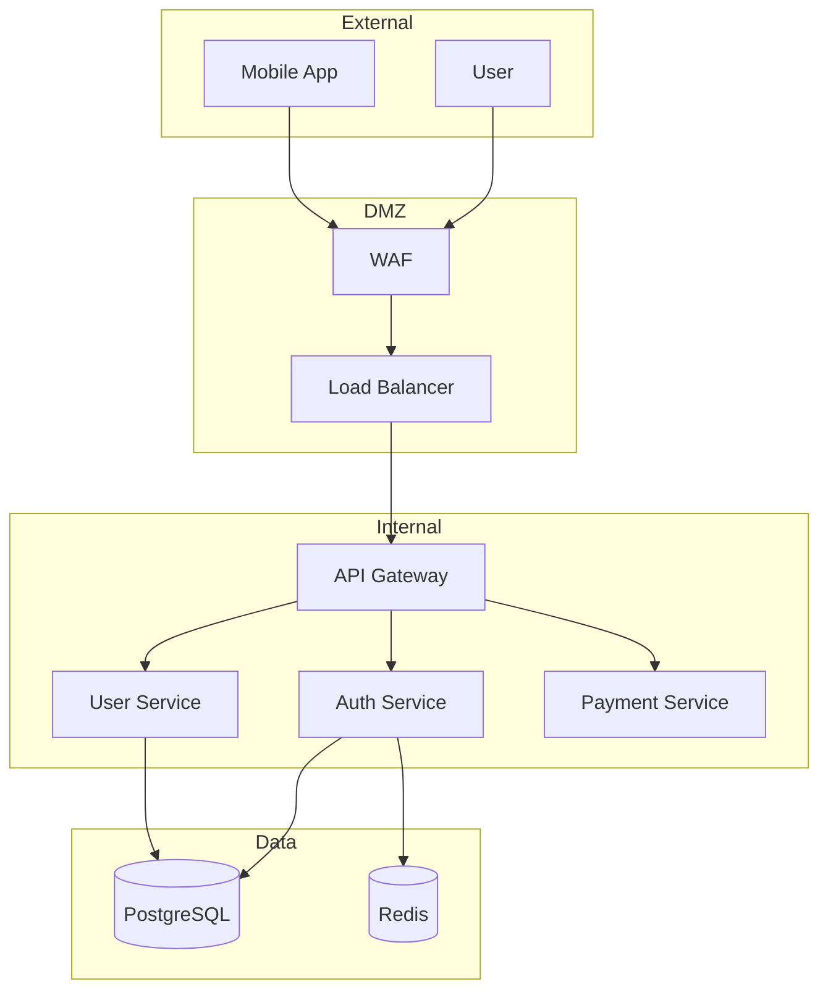
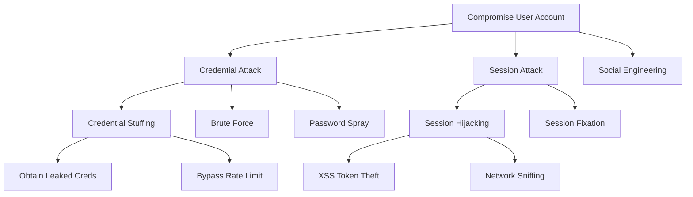
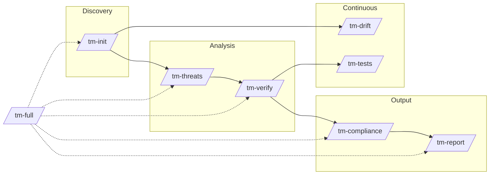

<p align="center">
  
  
  
</p>

<h1 align="center">Threat Modeling Toolkit</h1>

<p align="center">
  <strong>Threat modeling for everyone. One command. Any depth.</strong>
</p>

<p align="center">
  From quick security checks to comprehensive threat analysis—powered by Claude Code.
</p>

---

## Why This Exists

**The problem:** Threat modeling has always lived outside the developer's world. Specialized tools, separate workflows, complex frameworks that don't speak developer. Most devs skip it entirely—not because they don't care about security, but because the tooling doesn't meet them where they work.

**The solution:** Threat modeling inside your developer tools. No new UI. No external platform. Just slash commands in Claude Code—the same place you already write and review code.

**For developers:** `/tm-full --docs ./architecture` and you're done. Claude reads your design, identifies threats, checks if your code matches what you documented. No security background needed.

**For security professionals:** Go as deep as you need. Complex trust boundaries, attack trees, STRIDE analysis, multiple compliance frameworks, control verification with file:line evidence. The toolkit scales with your expertise.

## What It Does

- **Automatic discovery** - Reads your docs and extracts assets, data flows, trust boundaries
- **STRIDE analysis** - Systematic threat identification for every component
- **Code verification** - Searches your codebase to confirm controls actually exist
- **Compliance mapping** - Automatically maps to OWASP, SOC2, PCI-DSS
- **Gap detection** - Shows exactly what's missing, with file:line evidence
- **Test generation** - Creates security tests from identified threats

---

## Quick Start

```bash
# Install
/plugin marketplace add josemlopez/threat-modeling-toolkit
/plugin install threat-modeling-toolkit@josemlopez

# Run full analysis
/tm-full --docs ./architecture --compliance owasp,soc2
```

**Console Output:**

```
[1/5] Initializing...      ✓ 14 assets, 22 flows, 5 boundaries
[2/5] Analyzing threats... ✓ 47 threats identified
[3/5] Verifying controls... ✓ 18 verified, 7 partial, 4 missing
[4/5] Mapping compliance... ✓ OWASP: 82%, SOC2: 88%
[5/5] Generating report...  ✓

Threat Model Complete!
======================
Output: .threatmodel/
```

---

## The 9 Skills

| Skill | Purpose | Output |
|-------|---------|--------|
| `/tm-init` | Discover architecture | `assets.json`, `dataflows.json`, Mermaid diagrams |
| `/tm-threats` | Analyze threats | `threats.json`, `attack-trees.json`, risk scores |
| `/tm-verify` | Check code for controls | `controls.json`, `gaps.json` with file:line evidence |
| `/tm-compliance` | Map to frameworks | `compliance.json`, coverage percentages |
| `/tm-report` | Generate documentation | `risk-report.md`, `executive-summary.md` |
| `/tm-drift` | Track changes | Diff against baseline, new threat detection |
| `/tm-tests` | Create security tests | Test files for Jest/Pytest |
| `/tm-status` | Quick overview | Current posture summary |
| `/tm-full` | Complete workflow | Everything above, one command |

---

## What You Get

### Directory Structure

```
.threatmodel/
├── config.yaml                  # Configuration
├── state/
│   ├── assets.json              # Asset inventory
│   ├── dataflows.json           # Data flow definitions
│   ├── trust-boundaries.json    # Trust boundaries
│   ├── attack-surface.json      # Entry points
│   ├── threats.json             # Threat catalog
│   ├── attack-trees.json        # Attack decomposition
│   ├── controls.json            # Control inventory
│   ├── gaps.json                # Security gaps
│   ├── risk-register.json       # Risk prioritization
│   └── compliance.json          # Framework mapping
├── diagrams/
│   ├── architecture.mmd         # Mermaid: system view
│   ├── dataflow.mmd             # Mermaid: data flows
│   └── trust-boundaries.mmd     # Mermaid: boundaries
├── reports/
│   ├── risk-report.md           # Detailed findings
│   ├── executive-summary.md     # High-level summary
│   └── compliance-report.md     # Framework coverage
├── tests/
│   └── security-tests.ts        # Generated test cases
└── baseline/
    └── snapshot-YYYYMMDD.json   # Historical snapshots
```

---

## Phase 1: Discovery (`/tm-init`)

Reads your architecture docs and extracts assets, data flows, trust boundaries, and attack surface.

**Example `assets.json`:**

```json
{
  "version": "1.0",
  "generated": "2025-01-20T10:00:00Z",
  "assets": [
    {
      "id": "asset-001",
      "name": "User Database",
      "type": "data-store",
      "classification": "restricted",
      "description": "PostgreSQL database storing user data",
      "data_types": ["pii", "credentials"],
      "code_references": ["src/db/connection.ts"]
    },
    {
      "id": "asset-002",
      "name": "Auth Service",
      "type": "service",
      "classification": "confidential",
      "description": "Handles authentication and session management",
      "code_references": ["src/services/auth/"]
    }
  ]
}
```

**Generated Mermaid Diagram (`architecture.mmd`):**



**Console Output:**

```
Threat Model Initialized
========================

Project: My Application
Framework: STRIDE

Discovered:
  - 14 assets (4 services, 3 data stores, 2 clients, 5 integrations)
  - 22 data flows (8 cross trust boundaries)
  - 5 trust boundaries
  - 9 attack surface entries

Created:
  .threatmodel/config.yaml
  .threatmodel/state/assets.json
  .threatmodel/state/dataflows.json
  .threatmodel/state/trust-boundaries.json
  .threatmodel/state/attack-surface.json
  .threatmodel/diagrams/architecture.mmd
  .threatmodel/diagrams/dataflow.mmd

Next Steps:
  Run /tm-threats to analyze threats
```

---

## Phase 2: Threat Analysis (`/tm-threats`)

Applies STRIDE to every component and data flow crossing trust boundaries.

**Example `threats.json`:**

```json
{
  "version": "1.0",
  "generated": "2025-01-20T10:15:00Z",
  "threats": [
    {
      "id": "threat-001",
      "title": "Credential Stuffing Attack",
      "category": "spoofing",
      "target": {
        "asset_id": "asset-002",
        "component": "POST /api/auth/login"
      },
      "description": "Attacker uses leaked credentials from other breaches to attempt login",
      "attack_vector": "Automated login attempts with credential lists",
      "impact": {
        "confidentiality": "high",
        "integrity": "medium",
        "availability": "low"
      },
      "likelihood": "high",
      "risk_score": 8.5,
      "mitre_attack": ["T1110.001"],
      "cwe": ["CWE-307"],
      "countermeasures": [
        "Rate limiting on authentication endpoints",
        "Account lockout after failed attempts",
        "MFA enforcement",
        "Credential breach monitoring"
      ]
    }
  ]
}
```

**Attack Tree (Mermaid):**



**Console Output:**

```
Threat Analysis Complete
========================

Framework: STRIDE
Components Analyzed: 14

Threats by Category:
  Spoofing:              8
  Tampering:            10
  Repudiation:           4
  Information Disclosure: 9
  Denial of Service:     7
  Elevation of Privilege: 9

Threats by Severity:
  CRITICAL │██████████░░░░░░░░░░░░░░░░░░░░░░░░░░░░░░│  5  (11%)
      HIGH │████████████████████████░░░░░░░░░░░░░░░░│ 12  (26%)
    MEDIUM │████████████████████████████████████░░░░│ 18  (38%)
       LOW │████████████████████████░░░░░░░░░░░░░░░░│ 12  (26%)

Files Updated:
  .threatmodel/state/threats.json
  .threatmodel/state/attack-trees.json
  .threatmodel/state/risk-register.json

Next Steps:
  Run /tm-verify to check control implementations
```

---

## Phase 3: Control Verification (`/tm-verify`)

Searches your codebase to verify controls actually exist.

**Example `controls.json`:**

```json
{
  "version": "1.0",
  "controls": [
    {
      "id": "control-001",
      "name": "Rate Limiting on Auth Endpoints",
      "category": "authentication",
      "threats_mitigated": ["threat-001", "threat-002"],
      "implementation": {
        "status": "implemented",
        "method": "express-rate-limit middleware"
      },
      "verification": {
        "status": "verified",
        "evidence": [
          {
            "type": "code",
            "location": "src/middleware/rateLimiter.ts:15-45",
            "verified_at": "2025-01-20T10:30:00Z"
          }
        ]
      }
    }
  ]
}
```

**Example `gaps.json`:**

```json
{
  "version": "1.0",
  "gaps": [
    {
      "id": "gap-001",
      "title": "MFA Not Enforced for Admin Users",
      "severity": "high",
      "expected": "MFA required for all privileged accounts",
      "actual": "MFA optional, enforcement check missing",
      "evidence": {
        "code_search": "No MFA enforcement in auth middleware",
        "location": "src/middleware/auth.ts - missing MFA check"
      },
      "remediation": {
        "recommendation": "Add MFA enforcement check in admin routes",
        "effort": "medium"
      },
      "related_threats": ["threat-001", "threat-003"]
    }
  ]
}
```

**Console Output:**

```
Control Verification Complete
=============================

Controls Analyzed: 29

Verification Results:
  ✓ Implemented: 18
  ⚠ Partial:      7
  ✗ Missing:      4

Gaps Identified:
  Critical: 2
  High:     4
  Medium:   3
  Low:      2

Top Gaps:
  [GAP-001] HIGH: MFA not enforced
    Expected: Mandatory for admins
    Found: Optional in src/auth/mfa.ts

  [GAP-002] HIGH: SQL queries not parameterized
    Expected: Parameterized queries
    Found: Concatenation in src/legacy/reports.ts:120

Files Updated:
  .threatmodel/state/controls.json
  .threatmodel/state/gaps.json

Next Steps:
  Run /tm-compliance to map to frameworks
  Run /tm-report to generate risk report
```

---

## Phase 4: Compliance Mapping (`/tm-compliance`)

Maps threats and controls to OWASP, SOC2, PCI-DSS.

**Console Output:**

```
Compliance Mapping Complete
===========================

Frameworks Analyzed: 2

OWASP Top 10 2021:
  A01 Broken Access Control:     ████████░░ 85%  (1 gap)
  A02 Cryptographic Failures:    ██████████ 100%
  A03 Injection:                 ███████░░░ 70%  (3 gaps)
  A04 Insecure Design:           ██████░░░░ 55%  (5 gaps)
  A05 Security Misconfiguration: █████████░ 95%  (1 gap)
  A06 Vulnerable Components:     █████████░ 90%  (1 gap)
  A07 Auth Failures:             ████████░░ 75%  (4 gaps)
  A08 Data Integrity Failures:   ████████░░ 85%  (2 gaps)
  A09 Logging Failures:          ████████░░ 80%  (2 gaps)
  A10 SSRF:                      ██████████ 100%
  Overall: 82%

SOC2 Trust Services:
  CC6.1 Logical Access:          █████████░ 90%  (1 gap)
  CC6.2 Authentication:          ████████░░ 80%  (2 gaps)
  CC6.3 Access Restriction:      █████████░ 95%  (1 gap)
  Overall: 88%

Total Gaps: 11
  High Priority: 4
  Medium Priority: 5
  Low Priority: 2

Files Created:
  .threatmodel/state/compliance.json
  .threatmodel/reports/compliance-report.md

Next Steps:
  Run /tm-report to generate full risk report
```

---

## Phase 5: Reporting (`/tm-report`)

Generates markdown reports for stakeholders.

**Generated `executive-summary.md`:**

```markdown
# Threat Model - Executive Summary

**Project:** My Application v1.0.0
**Date:** January 20, 2025
**Classification:** Confidential

## Risk Posture

Current Risk Level: **MEDIUM-HIGH**

## Key Metrics

| Metric | Value |
|--------|-------|
| Threats Identified | 47 |
| Critical Findings | 5 |
| High Findings | 12 |
| Controls Verified | 62% |
| OWASP Compliance | 82% |
| SOC2 Compliance | 88% |

## Top 3 Priorities

1. **Enforce MFA for admin accounts** (Risk: 8.5)
2. **Fix SQL injection in reports module** (Risk: 8.2)
3. **Add rate limiting to password reset** (Risk: 7.8)

## Recommendations

Immediate actions required to address critical and high-severity findings.
Estimated remediation effort: 3-4 weeks.
```

---

## Phase 6: Drift Detection (`/tm-drift`)

Compares current state against baseline.

**Console Output:**

```
Drift Detection
===============

Baseline: January 15, 2025
Current:  January 20, 2025

Changes Detected:
  + 2 new assets (Redis Cache, Email Service)
  + 3 new attack surface entries
  ~ 1 control degraded (input validation now partial)

New Potential Threats:
  - Cache poisoning attacks
  - Email header injection
  - SSRF via email service

Recommendation: Run /tm-threats --focus asset-015,asset-016
```

---

## Phase 7: Test Generation (`/tm-tests`)

Generates security test cases from identified threats.

**Generated Tests (Jest):**

```typescript
// Generated by /tm-tests
// Threat: THREAT-001 - Credential Stuffing
// Control: CONTROL-001 - Rate Limiting

describe('Credential Stuffing Prevention', () => {
  it('should block after 5 failed attempts from same IP', async () => {
    const loginAttempt = () =>
      request(app)
        .post('/api/auth/login')
        .send({ email: 'test@example.com', password: 'wrong' });

    // Make 5 failed attempts
    for (let i = 0; i < 5; i++) {
      const res = await loginAttempt();
      expect(res.status).toBe(401);
    }

    // 6th attempt should be blocked
    const blocked = await loginAttempt();
    expect(blocked.status).toBe(429);
    expect(blocked.headers['retry-after']).toBeDefined();
  });

  it('should return consistent error messages', async () => {
    const validEmail = await request(app)
      .post('/api/auth/login')
      .send({ email: 'existing@example.com', password: 'wrong' });

    const invalidEmail = await request(app)
      .post('/api/auth/login')
      .send({ email: 'nonexistent@example.com', password: 'wrong' });

    // Messages must be identical to prevent enumeration
    expect(validEmail.body.message).toBe(invalidEmail.body.message);
  });
});
```

---

## Workflow Diagram



---

## Installation

```bash
# Add from marketplace
/plugin marketplace add josemlopez/threat-modeling-toolkit

# Install
/plugin install threat-modeling-toolkit@josemlopez
```

## Commands

```bash
# Full workflow
/tm-full --docs ./docs --compliance owasp,soc2

# Individual phases
/tm-init --docs ./architecture
/tm-threats --framework stride
/tm-verify --thorough --evidence
/tm-compliance --framework owasp
/tm-report --level detailed

# Monitoring
/tm-status
/tm-drift --create-baseline

# Testing
/tm-tests --format jest
```

---

## Roadmap

**v1.0 (Current)**
- 9 Skills for complete threat modeling workflow
- STRIDE framework
- OWASP Top 10, SOC2 compliance mapping
- Code-based control verification
- Drift detection
- Test generation

**v2.0 (Planned)**
- MCP Server for external integrations
- NVD/CVE vulnerability data
- Dependency scanning
- Jira integration
- Slack notifications

---

## Contributing

Contributions welcome! See [CONTRIBUTING.md](CONTRIBUTING.md) for guidelines.

## License

MIT License - see [LICENSE](LICENSE) for details.

---

<p align="center">
  <strong>Built with Claude Code</strong><br>
  <em>Because security shouldn't be a one-time checkbox—it should be a continuous practice.</em>
</p>

<p align="center">
  <a href="https://github.com/josemlopez/threat-modeling-toolkit">Star on GitHub</a> |
  <a href="https://github.com/josemlopez/threat-modeling-toolkit/issues">Report Bug</a> |
  <a href="https://github.com/josemlopez/threat-modeling-toolkit/issues">Request Feature</a>
</p>
