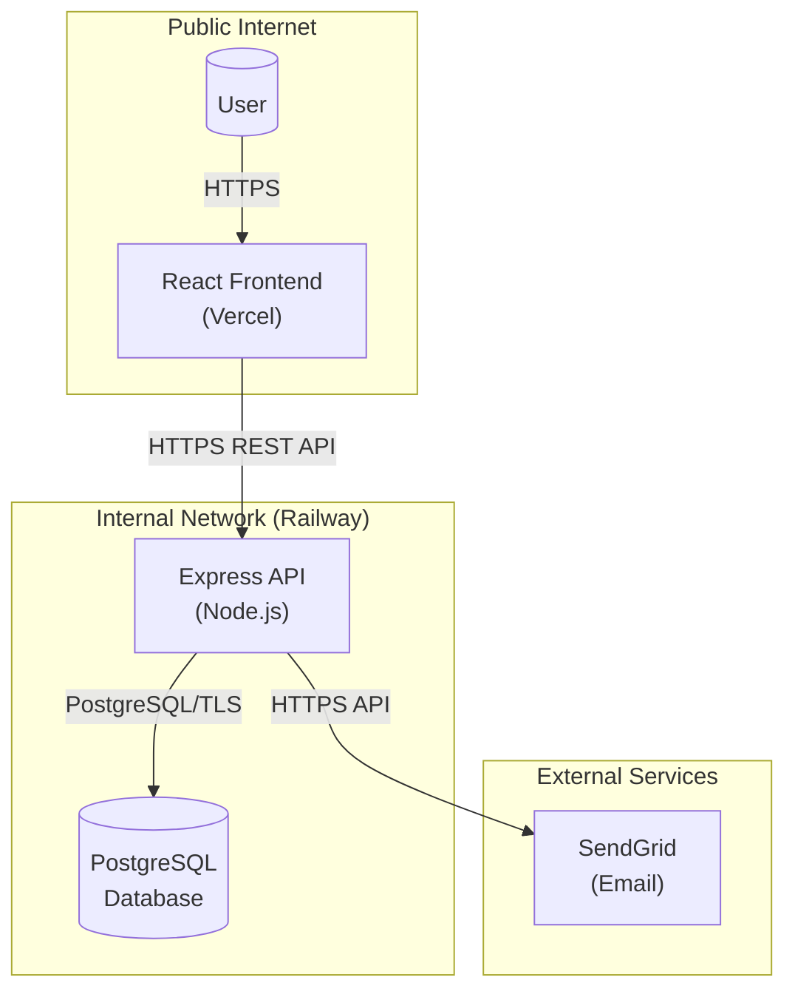
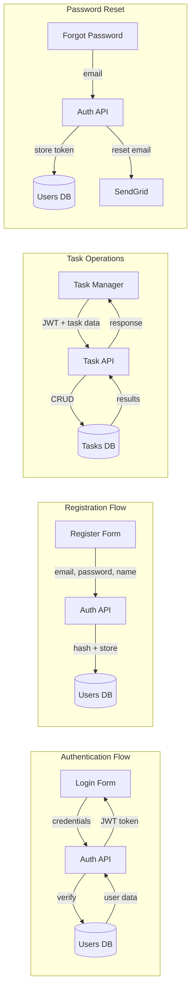

# Threat Model Initialization Results

**Project:** TaskFlow
**Framework:** STRIDE
**Generated:** 2026-01-21

---

## Summary

```
Threat Model Initialized
========================

Project: TaskFlow
Framework: STRIDE

Discovered:
  - 5 assets (1 client, 1 service, 1 data-store, 1 identity, 1 integration)
  - 8 data flows (8 cross trust boundaries)
  - 4 trust boundaries
  - 8 attack surface entries

Created:
  .threatmodel/config.yaml
  .threatmodel/state/assets.json
  .threatmodel/state/dataflows.json
  .threatmodel/state/trust-boundaries.json
  .threatmodel/state/attack-surface.json
  .threatmodel/diagrams/architecture.mmd
  .threatmodel/diagrams/dataflow.mmd

Next Steps:
  Run /tm-threats to analyze threats
```

---

## Assets Discovered

| ID | Name | Type | Classification | Description |
|----|------|------|----------------|-------------|
| asset-001 | React Frontend | client | public | React (Vite) SPA hosted on Vercel |
| asset-002 | Express API | service | internal | Node.js Express REST API on Railway |
| asset-003 | PostgreSQL Database | data-store | restricted | User accounts and task data storage |
| asset-004 | JWT Authentication | identity | confidential | JWT-based auth using HS256 |
| asset-005 | SendGrid Integration | integration | internal | Email service for password reset |

---

## Data Flows Identified

| ID | Name | Source | Destination | Protocol | Crosses Boundary |
|----|------|--------|-------------|----------|------------------|
| flow-001 | User Authentication | React LoginForm | Auth API | HTTPS | Yes (tb-001) |
| flow-002 | JWT Token Response | Auth API | React TokenStorage | HTTPS | Yes (tb-001) |
| flow-003 | User Registration | React RegisterForm | Auth API | HTTPS | Yes (tb-001) |
| flow-004 | Database User Query | Auth API | PostgreSQL | PostgreSQL/TLS | Yes (tb-002) |
| flow-005 | Task CRUD Operations | React TaskManager | Task API | HTTPS | Yes (tb-001) |
| flow-006 | Database Task Query | Task API | PostgreSQL | PostgreSQL/TLS | Yes (tb-002) |
| flow-007 | Password Reset Request | React ForgotPassword | Auth API | HTTPS | Yes (tb-001) |
| flow-008 | Password Reset Email | Auth API | SendGrid | HTTPS | Yes (tb-003) |

---

## Trust Boundaries

| ID | Name | Type | From Zone | To Zone |
|----|------|------|-----------|---------|
| tb-001 | Public Internet to API | network | public | internal |
| tb-002 | API to Database | network | internal | restricted |
| tb-003 | API to External Services | organizational | internal | external |
| tb-004 | Authentication Boundary | privilege | unauthenticated | authenticated |

---

## Attack Surface

| ID | Endpoint | Type | Auth | Gaps |
|----|----------|------|------|------|
| as-001 | POST /api/auth/register | api | none | - |
| as-002 | POST /api/auth/login | api | none | - |
| as-003 | POST /api/auth/forgot-password | api | none | **No rate limiting** |
| as-004 | GET /api/tasks | api | jwt | - |
| as-005 | POST /api/tasks | api | jwt | - |
| as-006 | PUT /api/tasks/:id | api | jwt | **Missing BOLA check** |
| as-007 | DELETE /api/tasks/:id | api | jwt | **Missing BOLA check** |
| as-008 | React Web Application | web-ui | session | **No CSRF protection** |

---

## Architecture Diagram



---

## Data Flow Diagram



---

## Key Security Observations

### Gaps Identified During Initialization:
1. **No rate limiting on `/forgot-password`** - Potential for abuse
2. **Missing object-level authorization** on task update/delete endpoints
3. **No CSRF protection** mentioned for web application
4. **Single-factor authentication only** - No MFA implementation

### Positive Controls Found:
- JWT authentication implemented
- Password hashing with bcrypt (cost factor 10)
- Parameterized SQL queries (prevents SQL injection)
- Rate limiting on login endpoint (5 attempts/15 min)
- HTTPS for all external communications
- User enumeration prevention on forgot-password response
