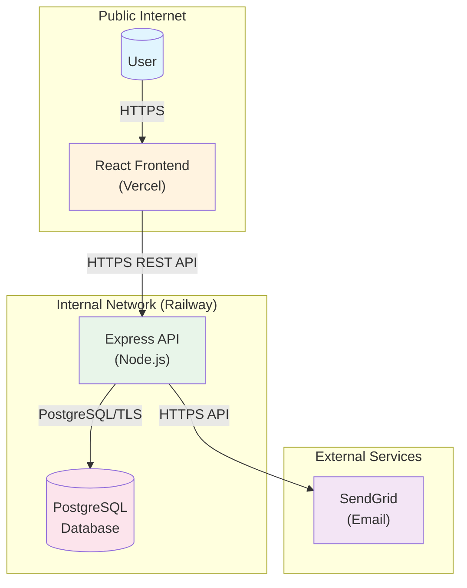
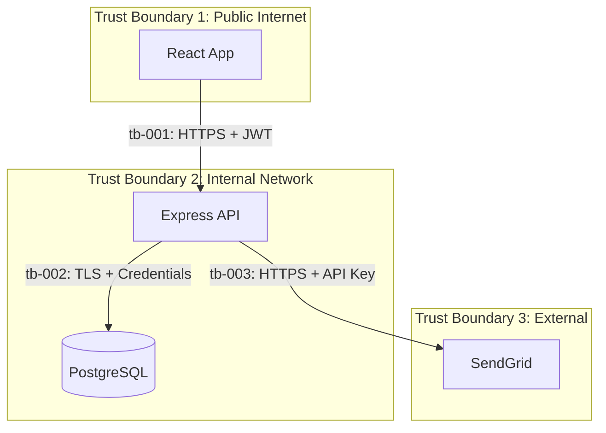

# Risk Report Generation Results

**Project:** TaskFlow
**Generated:** 2026-01-21
**Format:** Markdown
**Level:** Standard + Executive Summary

---

```
Report Generated
================

Reports Created:
  .threatmodel/reports/risk-report.md
  .threatmodel/reports/executive-summary.md

Report Contents:
  - Executive Summary (1 page)
  - 4 Critical Findings detailed
  - 10 Gaps documented
  - 10 Recommendations provided
  - Compliance status for 2 frameworks
  - Full appendices (threats, controls, diagrams)

Report Statistics:
  Total Threats: 15
  Total Controls: 15
  Total Gaps: 10
  Overall Risk Level: HIGH

The report is ready for review.
```

---

# Executive Summary

**Project**: TaskFlow
**Date**: 2026-01-20
**Classification**: Confidential

## Overview

This security assessment identified **15 threats** across **5 system components** in the TaskFlow application. **4 threats** are rated as **critical** and require immediate attention.

The application demonstrates good foundational security practices (password hashing, parameterized queries, JWT authentication) but has significant gaps in access control, authentication hardening, and security monitoring.

**Overall Risk Level**: HIGH

## Key Metrics

| Metric | Value | Status |
|--------|-------|--------|
| Total Threats | 15 | |
| Critical Threats | 4 | Immediate action required |
| Security Controls | 15 | 33% fully implemented |
| Security Gaps | 10 | 3 critical, 5 high |
| OWASP Compliance | 52% | Below target (80%) |
| SOC2 Compliance | 48% | Below target (70%) |

## Critical Findings

| # | Finding | Risk | Business Impact |
|---|---------|------|-----------------|
| 1 | **Broken Object-Level Authorization** | Critical (16) | Any user can modify/delete other users' tasks |
| 2 | **Missing Multi-Factor Authentication** | Critical (16) | Account takeover with single credential compromise |
| 3 | **Credential Stuffing Vulnerability** | Critical (16) | Mass account compromise using leaked credentials |
| 4 | **Password Reset Flood** | High (15) | Service disruption, email spam, cost increase |

## Compliance Status

```
OWASP Top 10 2021:   ██████░░░░  52%
SOC2 Trust Services: █████░░░░░  48%
```

**Critical Compliance Gaps:**
- A01: Broken Access Control (15%)
- A04: Insecure Design (0%)
- A09: Security Logging Failures (0%)

## Recommendations

### Immediate Priority (Week 1)
1. **Fix BOLA vulnerabilities** - Add ownership checks to PUT/DELETE task endpoints
2. **Add rate limiting** - Apply existing rate limiter to forgot-password endpoint

### Short-term Priority (Week 2-4)
3. **Implement security logging** - Add audit trail for authentication and access events
4. **Add CSRF protection** - Implement CSRF tokens for state-changing operations
5. **Enforce password policy** - Require minimum 12 characters with complexity

### Medium-term Priority (Month 2-3)
6. **Implement MFA** - Add TOTP-based two-factor authentication
7. **Add account lockout** - Lock accounts after repeated failed login attempts

## Resource Estimate

| Priority | Items | Estimated Effort |
|----------|-------|------------------|
| Immediate | 2 | 1-2 days |
| Short-term | 3 | 1-2 weeks |
| Medium-term | 2 | 2-4 weeks |
| **Total** | **7** | **4-8 weeks** |

---

# Full Risk Report Summary

## Risk Overview

### Risk Distribution

| Severity | Count | Mitigated | Unmitigated | Percentage |
|----------|-------|-----------|-------------|------------|
| Critical | 4 | 0 | 4 | 27% |
| High | 7 | 2 | 5 | 47% |
| Medium | 4 | 1 | 3 | 27% |
| Low | 0 | 0 | 0 | 0% |
| **Total** | **15** | **3** | **12** | 100% |

### Risk Heat Map

```
                    IMPACT
              Low   Med   High  Crit
         +-----+-----+-----+-----+
    High |     |  1  |  2  |  4  |  <- Likelihood
         +-----+-----+-----+-----+
     Med |     |  2  |  3  |     |
         +-----+-----+-----+-----+
     Low |     |  1  |  2  |     |
         +-----+-----+-----+-----+

Legend: Numbers = threat count in each cell
Critical zone (top-right): 4 threats
High risk zone: 5 threats
Medium risk zone: 6 threats
```

### STRIDE Category Distribution

| Category | Count | Percentage |
|----------|-------|------------|
| Spoofing | 5 | 33% |
| Tampering | 2 | 13% |
| Repudiation | 1 | 7% |
| Information Disclosure | 3 | 20% |
| Denial of Service | 1 | 7% |
| Elevation of Privilege | 3 | 20% |

---

## Critical Findings Details

### 1. Broken Object-Level Authorization (BOLA)

**Threats:** THREAT-003, THREAT-004
**Risk Score:** 16/25 (Critical)
**Target:** PUT/DELETE /api/tasks/:id

**Issue:** Any authenticated user can modify or delete ANY task in the system.

**Code Location:**
- `src/routes/tasks.js:44-52` (UPDATE)
- `src/routes/tasks.js:67-74` (DELETE)

**Fix:** Add `AND user_id = req.user.userId` to WHERE clauses.

---

### 2. Missing Multi-Factor Authentication

**Threat:** THREAT-013
**Risk Score:** 16/25 (Critical)
**Target:** Authentication System

**Issue:** Password-only authentication with no second factor.

**Fix:** Implement TOTP-based MFA using speakeasy/otplib.

---

### 3. Credential Stuffing Vulnerability

**Threat:** THREAT-001
**Risk Score:** 16/25 (Critical)
**Target:** POST /api/auth/login

**Issue:** Rate limiting can be bypassed with distributed attacks; no account lockout.

**Fix:** Add account lockout, MFA, credential breach monitoring.

---

### 4. Password Reset Flood Attack

**Threat:** THREAT-002
**Risk Score:** 15/25 (High)
**Target:** POST /api/auth/forgot-password

**Issue:** No rate limiting on password reset endpoint.

**Fix:** Add `loginLimiter` middleware (trivial fix).

---

## Gap Analysis Summary

| Severity | Count | Examples |
|----------|-------|----------|
| Critical | 3 | BOLA (x2), Missing MFA |
| High | 5 | Rate limiting, logging, lockout, password policy |
| Medium | 2 | CSRF, registration enumeration |
| Low | 0 | - |

### Remediation Effort Matrix

| Effort | Count | Total Time |
|--------|-------|------------|
| Trivial (< 1 hour) | 1 | 30 min |
| Low (< 1 day) | 3 | 1-2 days |
| Medium (< 1 week) | 4 | 2-3 weeks |
| High (> 1 week) | 1 | 2-3 weeks |

---

## Compliance Summary

### OWASP Top 10 2021 (52% Overall)

| Requirement | Coverage | Status |
|-------------|----------|--------|
| A01 Broken Access Control | 15% | NON-COMPLIANT |
| A02 Cryptographic Failures | 90% | COMPLIANT |
| A03 Injection | 70% | PARTIAL |
| A04 Insecure Design | 0% | NON-COMPLIANT |
| A05 Security Misconfiguration | 50% | PARTIAL |
| A06 Vulnerable Components | N/A | UNKNOWN |
| A07 Authentication Failures | 45% | PARTIAL |
| A08 Integrity Failures | 0% | NON-COMPLIANT |
| A09 Logging Failures | 0% | NON-COMPLIANT |
| A10 SSRF | N/A | NOT APPLICABLE |

### SOC2 Trust Services (48% Overall)

| Criteria | Coverage | Status |
|----------|----------|--------|
| CC6.1 Logical Access | 40% | PARTIAL |
| CC6.2 Authentication | 35% | PARTIAL |
| CC6.3 Access Restrictions | 20% | NON-COMPLIANT |
| CC6.6 System Boundaries | 70% | PARTIAL |
| CC6.7 Transmission Integrity | 100% | COMPLIANT |
| CC7.2 Change Management | 0% | NON-COMPLIANT |

---

## Prioritized Recommendations

### Week 1 (Critical/Quick Wins)

| # | Action | Gap | Effort | Impact |
|---|--------|-----|--------|--------|
| 1 | Fix BOLA on PUT /tasks/:id | GAP-001 | 2 hours | Critical |
| 2 | Fix BOLA on DELETE /tasks/:id | GAP-002 | 2 hours | Critical |
| 3 | Add rate limiting to forgot-password | GAP-003 | 30 min | High |

### Weeks 2-4 (High Priority)

| # | Action | Gap | Effort | Impact |
|---|--------|-----|--------|--------|
| 4 | Implement security logging | GAP-006 | 1 week | High |
| 5 | Add CSRF protection | GAP-005 | 3 days | Medium |
| 6 | Enforce password policy | GAP-008 | 2 days | High |
| 7 | Add account lockout | GAP-007 | 3 days | High |

### Month 2-3 (Strategic)

| # | Action | Gap | Effort | Impact |
|---|--------|-----|--------|--------|
| 8 | Implement MFA | GAP-004 | 2-3 weeks | Critical |
| 9 | Add schema validation | GAP-010 | 1 week | Medium |
| 10 | Fix registration enumeration | GAP-009 | 1 day | Low |

---

## Architecture Diagrams

### System Architecture



### Trust Boundaries



---

## Document Information

| Field | Value |
|-------|-------|
| Report Version | 1.0 |
| Generated By | Threat Modeling Toolkit |
| Generation Date | 2026-01-20 |
| Next Review Date | 2026-02-20 |
| Classification | Confidential |

---

*Report generated by Threat Modeling Toolkit v1.0*
