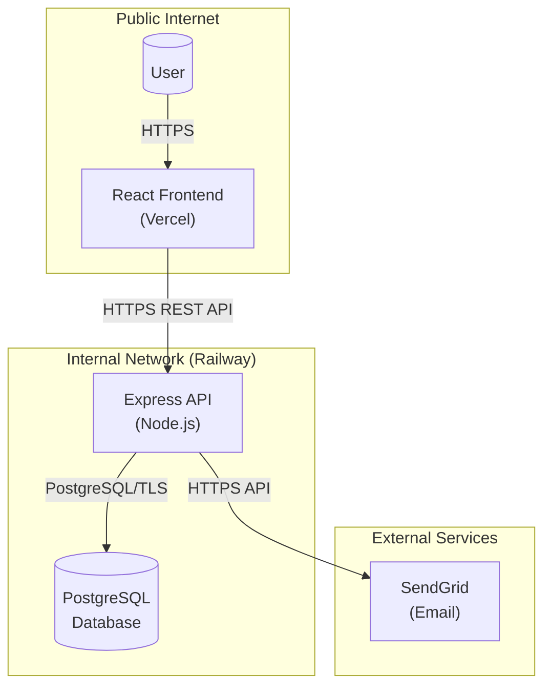
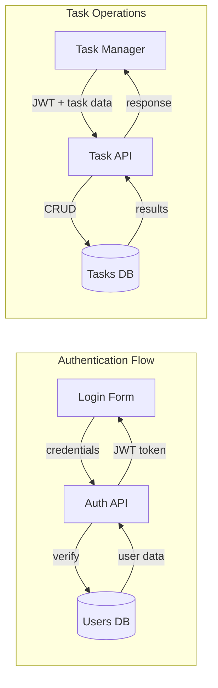

# Threat Model Risk Report

**Project**: TaskFlow
**Version**: 1.0.0
**Generated**: 2026-01-20
**Framework**: STRIDE
**Classification**: Confidential

---

## Table of Contents

1. [Executive Summary](#executive-summary)
2. [Risk Overview](#risk-overview)
3. [Critical Findings](#critical-findings)
4. [High-Priority Findings](#high-priority-findings)
5. [Gap Analysis](#gap-analysis)
6. [Compliance Status](#compliance-status)
7. [Recommendations](#recommendations)
8. [Appendix A: Threat Catalog](#appendix-a-threat-catalog)
9. [Appendix B: Control Inventory](#appendix-b-control-inventory)
10. [Appendix C: Architecture Diagrams](#appendix-c-architecture-diagrams)

---

## Executive Summary

TaskFlow is a task management application built with React frontend, Express.js API, and PostgreSQL database. This threat model assessment analyzed the application's security posture using the STRIDE methodology.

### Key Findings

- **15 threats** identified across 5 system components
- **4 critical** and **7 high** severity threats require attention
- **10 security gaps** identified, with 3 critical gaps
- **52% OWASP compliance** and **48% SOC2 compliance**

### Overall Risk Assessment

| Category | Rating |
|----------|--------|
| **Overall Risk Level** | HIGH |
| **Authentication Security** | MEDIUM |
| **Authorization Security** | LOW |
| **Data Protection** | HIGH |
| **Monitoring Capability** | LOW |

The most significant issues are **broken object-level authorization** on task operations and **missing multi-factor authentication**, both of which could lead to unauthorized data access or account compromise.

---

## Risk Overview

### Risk Distribution

| Severity | Count | Mitigated | Unmitigated | Percentage |
|----------|-------|-----------|-------------|------------|
| Critical | 4 | 0 | 4 | 27% |
| High | 7 | 2 | 5 | 47% |
| Medium | 4 | 1 | 3 | 27% |
| Low | 0 | 0 | 0 | 0% |
| **Total** | **15** | **3** | **12** | 100% |

### Risk Heat Map

```
                    IMPACT
              Low   Med   High  Crit
         ┌─────┬─────┬─────┬─────┐
    High │     │  1  │  2  │  4  │  ← Likelihood
         ├─────┼─────┼─────┼─────┤
     Med │     │  2  │  3  │     │
         ├─────┼─────┼─────┼─────┤
     Low │     │  1  │  2  │     │
         └─────┴─────┴─────┴─────┘

Legend: Numbers = threat count in each cell
Critical zone (top-right): 4 threats
High risk zone: 5 threats
Medium risk zone: 6 threats
```

### STRIDE Category Distribution

| Category | Count | Description |
|----------|-------|-------------|
| Spoofing | 5 | Identity/authentication threats |
| Tampering | 2 | Data integrity threats |
| Repudiation | 1 | Audit/logging threats |
| Information Disclosure | 3 | Confidentiality threats |
| Denial of Service | 1 | Availability threats |
| Elevation of Privilege | 3 | Authorization threats |

---

## Critical Findings

### THREAT-001: Credential Stuffing Attack

**Risk Score**: 16/25 (Critical)
**Category**: Spoofing
**Target**: POST /api/auth/login

#### Description
Attackers can use leaked credentials from other data breaches to gain unauthorized access to user accounts. While rate limiting exists (5 requests per 15 minutes), distributed attacks using multiple IP addresses can bypass this protection.

#### Attack Scenario
1. Attacker obtains leaked credential database from dark web
2. Attacker distributes attack across multiple IP addresses/proxies
3. Rate limiting is bypassed due to IP-based (not account-based) limiting
4. Valid credentials grant access to user accounts

#### Business Impact
- **Confidentiality**: HIGH - Full access to user data and tasks
- **Integrity**: MEDIUM - Ability to modify/delete user data
- **Availability**: LOW - Individual account lockout possible

#### Current Controls
| Control | Status | Effectiveness |
|---------|--------|---------------|
| Rate Limiting | Implemented | 70% |
| Password Hashing | Implemented | 90% |
| MFA | Missing | 0% |
| Account Lockout | Missing | 0% |

#### Recommended Countermeasures
1. **Implement MFA** (High Priority)
   - Add TOTP-based second factor using authenticator apps
   - Effort: High | Timeline: 2-4 weeks

2. **Add Account Lockout** (Medium Priority)
   - Lock account after 10 failed attempts
   - Effort: Medium | Timeline: 3-5 days

3. **Credential Monitoring** (Low Priority)
   - Check passwords against known breach databases
   - Effort: Low | Timeline: 1-2 days

---

### THREAT-003 & THREAT-004: Broken Object-Level Authorization (BOLA)

**Risk Score**: 16/25 (Critical)
**Category**: Elevation of Privilege
**Target**: PUT /api/tasks/:id, DELETE /api/tasks/:id

#### Description
Authenticated users can modify or delete ANY task in the system, regardless of ownership. The endpoints verify that the user is authenticated but do NOT verify that the user owns the resource being accessed.

#### Attack Scenario
1. Attacker registers a legitimate account and obtains JWT token
2. Attacker enumerates task IDs (sequential or brute-force)
3. Attacker sends PUT/DELETE request for another user's task
4. Request succeeds because only authentication is checked

#### Business Impact
- **Confidentiality**: MEDIUM - Can infer task existence
- **Integrity**: HIGH - Can modify any user's tasks
- **Availability**: MEDIUM - Can delete any user's tasks

#### Current Controls
| Control | Status | Effectiveness |
|---------|--------|---------------|
| JWT Authentication | Implemented | 100% (for auth) |
| Object-Level Auth | Missing | 0% |
| User-Scoped Queries | Partial (GET only) | 30% |

#### Recommended Countermeasures
1. **Add Ownership Verification** (Critical Priority)
   - Modify UPDATE query: `WHERE id = $5 AND user_id = $6`
   - Modify DELETE query: `WHERE id = $1 AND user_id = $2`
   - Effort: Low | Timeline: 1 day

#### Code Fix Example
```javascript
// BEFORE (Vulnerable)
const result = await db.query(
  'UPDATE tasks SET ... WHERE id = $5',
  [title, description, status, dueDate, id]
);

// AFTER (Secure)
const result = await db.query(
  'UPDATE tasks SET ... WHERE id = $5 AND user_id = $6',
  [title, description, status, dueDate, id, req.user.userId]
);
```

---

### THREAT-013: Missing Multi-Factor Authentication

**Risk Score**: 16/25 (Critical)
**Category**: Spoofing
**Target**: Authentication System

#### Description
The application relies solely on password-based authentication. If a user's password is compromised through phishing, data breach, or social engineering, there is no secondary barrier to prevent account takeover.

#### Attack Scenario
1. Attacker obtains user password via phishing email
2. Attacker logs in with stolen credentials
3. No MFA challenge blocks the login
4. Full account access granted immediately

#### Business Impact
- **Confidentiality**: HIGH - Complete account access
- **Integrity**: HIGH - Full control over user data
- **Availability**: LOW - Account can be locked out

#### Recommended Countermeasures
1. **Implement TOTP-Based MFA** (High Priority)
   - Use speakeasy or otplib library
   - Effort: High | Timeline: 2-3 weeks
   - Steps:
     - Add MFA setup endpoint
     - Store encrypted TOTP secret
     - Add MFA verification to login flow
     - Provide recovery codes

---

## High-Priority Findings

### THREAT-002: Password Reset Flood Attack

**Risk Score**: 15/25 (High)
**Category**: Denial of Service
**Target**: POST /api/auth/forgot-password

**Issue**: No rate limiting on password reset endpoint allows attackers to:
- Flood users with unwanted password reset emails
- Increase SendGrid costs
- Potentially exhaust email service quotas

**Fix**: Apply existing `loginLimiter` middleware to the endpoint.

---

### THREAT-006: JWT Token Theft via XSS

**Risk Score**: 12/25 (High)
**Category**: Spoofing
**Target**: React Frontend

**Issue**: If XSS vulnerability exists, JWT tokens stored in localStorage can be stolen.

**Fix**: Use HttpOnly cookies for JWT storage, implement Content Security Policy.

---

### THREAT-007: Brute Force Login Attack

**Risk Score**: 12/25 (High)
**Category**: Spoofing
**Target**: POST /api/auth/login

**Issue**: Rate limiting exists but no account lockout mechanism.

**Fix**: Add account lockout after 10 failed attempts.

---

### THREAT-010: Insufficient Logging and Monitoring

**Risk Score**: 12/25 (High)
**Category**: Repudiation
**Target**: All API Endpoints

**Issue**: No security event logging for authentication failures, access violations, or data modifications.

**Fix**: Implement structured logging with winston/pino for security events.

---

### THREAT-011: Weak Password Policy

**Risk Score**: 12/25 (High)
**Category**: Spoofing
**Target**: POST /api/auth/register

**Issue**: No password strength requirements during registration.

**Fix**: Enforce minimum 12 characters, complexity rules, or use zxcvbn library.

---

## Gap Analysis

### Critical Gaps

| ID | Gap | Control | Effort | Priority |
|----|-----|---------|--------|----------|
| GAP-001 | BOLA on Task Update | control-010 | Low | Critical |
| GAP-002 | BOLA on Task Delete | control-010 | Low | Critical |
| GAP-004 | No MFA Implementation | control-012 | High | Critical |

### High Gaps

| ID | Gap | Control | Effort | Priority |
|----|-----|---------|--------|----------|
| GAP-003 | No Rate Limiting on Forgot-Password | control-009 | Trivial | High |
| GAP-006 | No Security Event Logging | control-013 | Medium | High |
| GAP-007 | No Account Lockout | control-014 | Medium | High |
| GAP-008 | No Password Strength Requirements | control-015 | Low | High |
| GAP-005 | No CSRF Protection | control-011 | Medium | Medium |

### Gap Remediation Effort Summary

| Effort Level | Count | Examples |
|--------------|-------|----------|
| Trivial | 1 | Add rate limiter middleware |
| Low | 3 | BOLA fixes, password policy |
| Medium | 4 | Logging, CSRF, account lockout |
| High | 1 | MFA implementation |

---

## Compliance Status

### OWASP Top 10 2021

| Requirement | Coverage | Status | Key Gaps |
|-------------|----------|--------|----------|
| A01 Broken Access Control | 15% | Non-Compliant | BOLA on PUT/DELETE |
| A02 Cryptographic Failures | 90% | Compliant | - |
| A03 Injection | 70% | Partial | No schema validation |
| A04 Insecure Design | 0% | Non-Compliant | No MFA, No CSRF |
| A05 Security Misconfiguration | 50% | Partial | Missing rate limits |
| A06 Vulnerable Components | N/A | Unknown | Requires npm audit |
| A07 Authentication Failures | 45% | Partial | MFA, lockout, policy |
| A08 Integrity Failures | 0% | Non-Compliant | No CSRF protection |
| A09 Logging Failures | 0% | Non-Compliant | No security logging |
| A10 SSRF | N/A | Not Applicable | - |

**Overall OWASP Compliance: 52%**

### SOC2 Trust Services Criteria

| Criteria | Coverage | Status |
|----------|----------|--------|
| CC6.1 Logical Access | 40% | Partial |
| CC6.2 Authentication | 35% | Partial |
| CC6.3 Access Restrictions | 20% | Non-Compliant |
| CC6.6 System Boundaries | 70% | Partial |
| CC6.7 Transmission Integrity | 100% | Compliant |
| CC7.2 Change Management | 0% | Non-Compliant |

**Overall SOC2 Compliance: 48%**

---

## Recommendations

### Immediate Actions (Week 1)

| Priority | Action | Gap | Effort | Impact |
|----------|--------|-----|--------|--------|
| 1 | Fix BOLA on PUT /tasks/:id | GAP-001 | 2 hours | Critical |
| 2 | Fix BOLA on DELETE /tasks/:id | GAP-002 | 2 hours | Critical |
| 3 | Add rate limiting to forgot-password | GAP-003 | 30 min | High |

**Quick Win**: These 3 fixes address 3 critical/high gaps with minimal effort.

### Short-term Actions (Weeks 2-4)

| Priority | Action | Gap | Effort | Impact |
|----------|--------|-----|--------|--------|
| 4 | Implement security logging | GAP-006 | 1 week | High |
| 5 | Add CSRF protection | GAP-005 | 3 days | Medium |
| 6 | Enforce password policy | GAP-008 | 2 days | High |
| 7 | Add account lockout | GAP-007 | 3 days | High |

### Medium-term Actions (Month 2-3)

| Priority | Action | Gap | Effort | Impact |
|----------|--------|-----|--------|--------|
| 8 | Implement MFA | GAP-004 | 2-3 weeks | Critical |
| 9 | Add schema validation | GAP-010 | 1 week | Medium |
| 10 | Fix registration enumeration | GAP-009 | 1 day | Low |

---

## Appendix A: Threat Catalog

| ID | Title | Category | Risk | Status |
|----|-------|----------|------|--------|
| THREAT-001 | Credential Stuffing Attack | Spoofing | 16 | Open |
| THREAT-002 | Password Reset Flood | DoS | 15 | Open |
| THREAT-003 | BOLA - Task Update | EoP | 16 | Open |
| THREAT-004 | BOLA - Task Delete | EoP | 16 | Open |
| THREAT-005 | CSRF Attack | Tampering | 9 | Open |
| THREAT-006 | JWT Token Theft via XSS | Spoofing | 12 | Open |
| THREAT-007 | Brute Force Login | Spoofing | 12 | Partial |
| THREAT-008 | JWT Secret Exposure | Info Disc | 10 | Monitored |
| THREAT-009 | SQL Injection | Tampering | 10 | Mitigated |
| THREAT-010 | Insufficient Logging | Repudiation | 12 | Open |
| THREAT-011 | Weak Password Policy | Spoofing | 12 | Open |
| THREAT-012 | Account Enumeration | Info Disc | 8 | Partial |
| THREAT-013 | Missing MFA | Spoofing | 16 | Open |
| THREAT-014 | Insecure Reset Token | Spoofing | 8 | Monitored |
| THREAT-015 | SendGrid API Key Exposure | Info Disc | 6 | Monitored |

---

## Appendix B: Control Inventory

### Implemented Controls

| ID | Control | Effectiveness | Evidence |
|----|---------|---------------|----------|
| CTRL-001 | Password Hashing (bcrypt) | 90% | src/routes/auth.js:20 |
| CTRL-002 | JWT Authentication | 80% | src/middleware/auth.js:16 |
| CTRL-003 | Rate Limiting (Login) | 70% | src/middleware/rateLimiter.js:4 |
| CTRL-004 | Parameterized SQL | 95% | All db.query() calls |
| CTRL-005 | Secure Reset Token | 85% | src/routes/auth.js:76 |

### Partial Controls

| ID | Control | Issue |
|----|---------|-------|
| CTRL-006 | User Enumeration Prevention | Registration leaks info |
| CTRL-007 | User-Scoped Queries | Only GET, not PUT/DELETE |
| CTRL-008 | Input Validation | Presence checks only |

### Missing Controls

| ID | Control | Related Threats |
|----|---------|-----------------|
| CTRL-009 | Rate Limiting (Forgot-Password) | THREAT-002 |
| CTRL-010 | Object-Level Authorization | THREAT-003, THREAT-004 |
| CTRL-011 | CSRF Protection | THREAT-005 |
| CTRL-012 | Multi-Factor Authentication | THREAT-001, THREAT-013 |
| CTRL-013 | Security Event Logging | THREAT-010 |
| CTRL-014 | Account Lockout | THREAT-007 |
| CTRL-015 | Password Strength Enforcement | THREAT-011 |

---

## Appendix C: Architecture Diagrams

### System Architecture



### Data Flow Diagram



---

## Document Information

| Field | Value |
|-------|-------|
| Report Version | 1.0 |
| Generated By | Threat Modeling Toolkit |
| Generation Date | 2026-01-20 |
| Next Review Date | 2026-02-20 |
| Classification | Confidential |

---

*End of Report*
